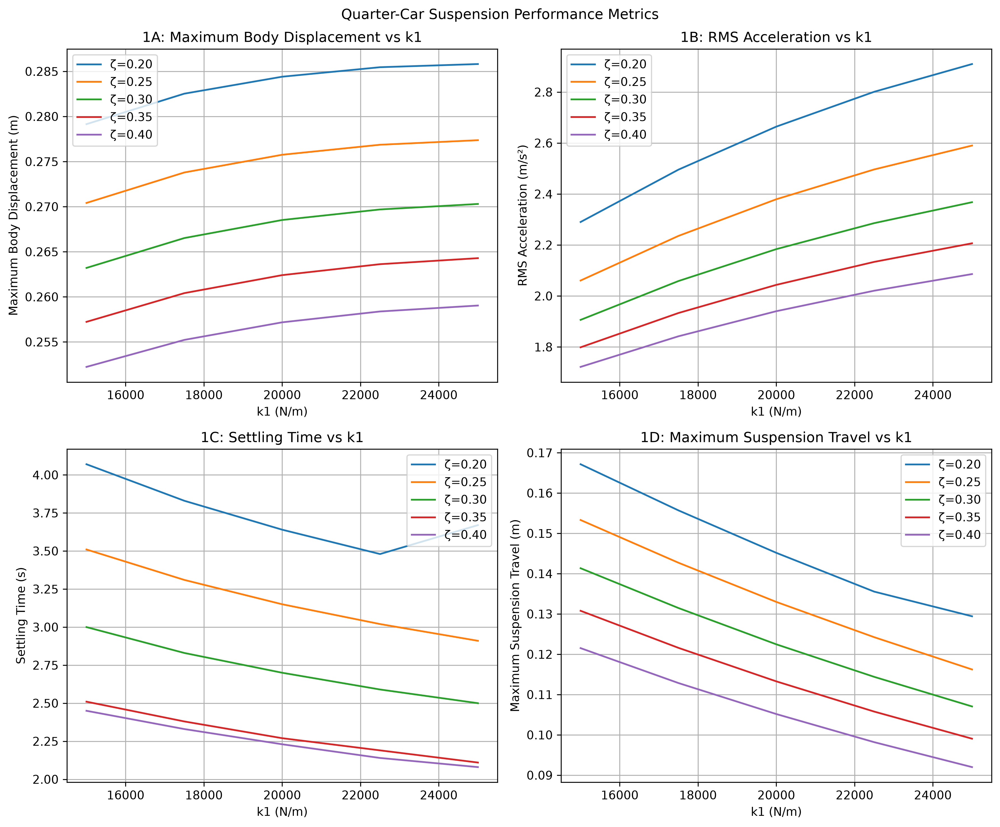
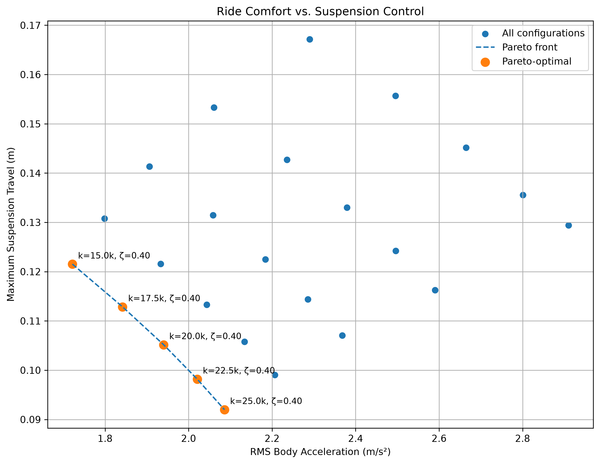

# Quarter-Car Suspension Dynamics & Optimization

A Python-based computational model of a 2-DOF quarter-car suspension system used to investigate how suspension stiffness and damping affect vehicle dynamic response to road disturbances.

## Engineering Question

How can suspension stiffness and damping ratio be optimized to reduce vibration while maintaining controlled suspension travel when subjected to road disturbances?

## Project Overview

This project models a quarter-car suspension system consisting of a sprung mass, unsprung mass, suspension spring and damper, and tire stiffness.

The simulation evaluates the system's response to a modeled road bump and performs a parametric sweep across **25 combinations** of suspension stiffness and damping ratio.

The goal is to identify the tradeoff between **ride isolation** and **suspension control** rather than assuming that a single configuration is optimal for every performance objective.

### Design Variables

* Suspension stiffness, `k₁`: 15,000–25,000 N/m
* Damping ratio, `ζ₁`: 0.20–0.40

### Fixed Parameters

* Sprung mass: 400 kg
* Unsprung mass: 30 kg
* Tire stiffness: 200,000 N/m
* Bump height: 0.2 m
* Bump length: 0.8 m
* Vehicle speed: 0.85 m/s

## Simulation Method

The suspension dynamics are represented using a state-space formulation and solved numerically using `scipy.integrate.odeint`.

The model evaluates four performance metrics:

1. Maximum body displacement
2. RMS body acceleration
3. Settling time
4. Maximum suspension travel

A parametric sweep evaluates all 25 combinations of `k₁` and `ζ₁`. The resulting configurations are then compared using a multi-objective Pareto analysis based on **RMS body acceleration** and **maximum suspension travel**.

## Results

The parameter sweep demonstrates a multi-objective tradeoff between ride isolation and suspension control.

Lower suspension stiffness generally reduces body displacement and acceleration, while higher stiffness reduces suspension travel and generally improves recovery time. Increasing damping improved all four measured metrics within the tested parameter range.

No single configuration minimized every metric simultaneously.

### Performance Overview



### Ride Comfort vs. Suspension Control



The Pareto analysis identified **five non-dominated configurations**, all with a damping ratio of `ζ₁ = 0.40`.

Along the Pareto front, increasing stiffness produces a tradeoff:

* Lower stiffness minimizes RMS body acceleration.
* Higher stiffness minimizes maximum suspension travel.
* Intermediate stiffness values provide compromises between the two objectives.

## Key Findings

### Ride Comfort

The configuration with:

* `k₁ = 15,000 N/m`
* `ζ₁ = 0.40`

produced the lowest RMS body acceleration among the tested configurations:

**1.72 m/s²**

It also produced the lowest maximum body displacement:

**0.252 m**

This configuration represents the ride-isolation end of the tested design space.

### Suspension Control

The configuration with:

* `k₁ = 25,000 N/m`
* `ζ₁ = 0.40`

produced the lowest maximum suspension travel:

**0.092 m**

It also produced the shortest settling time:

**2.08 s**

This configuration represents the suspension-control end of the tested design space.

### Pareto-Optimal Configurations

The five non-dominated configurations were:

| Suspension Stiffness `k₁` | Damping Ratio `ζ₁` | RMS Acceleration (m/s²) | Max Suspension Travel (m) |
| ------------------------: | -----------------: | ----------------------: | ------------------------: |
|                15,000 N/m |               0.40 |                   1.722 |                     0.122 |
|                17,500 N/m |               0.40 |                   1.842 |                     0.113 |
|                20,000 N/m |               0.40 |                   1.940 |                     0.105 |
|                22,500 N/m |               0.40 |                   2.021 |                     0.098 |
|                25,000 N/m |               0.40 |                   2.086 |                     0.092 |

These configurations form a range of viable design choices rather than a single universal optimum.

## Engineering Interpretation

The results show that suspension design is a **multi-objective optimization problem**.

A softer suspension can improve ride isolation by reducing body acceleration, but it allows greater suspension travel. A stiffer suspension limits suspension travel and generally improves recovery time, but increases the acceleration transmitted to the vehicle body.

Within the tested parameter range, higher damping consistently improved the measured response. The Pareto analysis also showed that all non-dominated configurations used the highest tested damping ratio of `ζ₁ = 0.40`.

The preferred suspension characteristics therefore depend on the intended vehicle application and its performance priorities.

## Future Work

Future development will extend the computational model toward physical validation using a bench-scale suspension test platform and Arduino-based instrumentation.

Planned extensions include:

* Physical acceleration and displacement measurements
* Comparison between simulated and experimental results
* Additional terrain profiles
* Repeated and irregular road disturbances
* Expanded parameter studies
* Validation of the computational model against experimental data
* Application to robotics and off-road vehicle systems

The eventual physical test platform will provide a pathway from computational modeling to experimental validation, allowing the same engineering concepts to be applied to future robotics and vehicle dynamics projects.

## Repository Structure

```text
quarter-car-suspension/
├── README.md
├── requirements.txt
├── src/
│   └── suspension_model.py
├── data/
│   ├── parameter_sweep.csv
│   └── pareto_optimal.csv
├── figures/
│   ├── performance_metrics.png
│   └── comfort_vs_control.png
└── report/
    └── suspension_dynamics_report.md
```

## Tools

* Python
* NumPy
* SciPy
* Matplotlib
* Git & GitHub